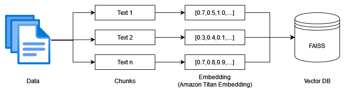
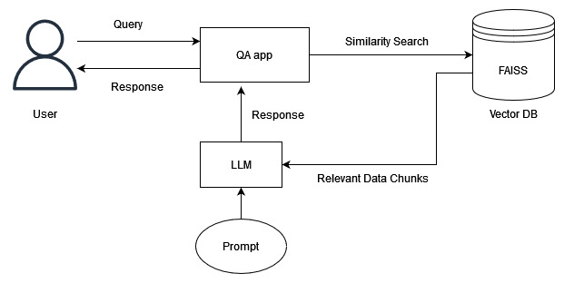

# Question Answering with LLM and RAG

## Overview

This project demonstrates the implementation of a question-answering system utilizing state-of-the-art Large Language Models (LLMs) like Llama, Stable AI, and Amazon Titan via AWS Bedrock. The system enhances response accuracy through Retrieval-Augmented Generation (RAG) techniques, employing a vector database (FAISS) for efficient data storage and retrieval. The project features a user-friendly interface developed with Streamlit, and robust deployment pipelines using GitHub Actions, AWS ECR, and AWS App Runner for continuous integration and deployment.

## Features

- Integration of Multiple LLMs: Utilizes models like Llama, Stable AI, and Amazon Titan for comprehensive language understanding and generation.
- Vector Database Storage: Uses FAISS to handle vector storage, enabling efficient querying and data retrieval.
- Streamlit UI: A simple, interactive web interface for users to pose questions and receive answers.
- Continuous Integration/Deployment: Leverages GitHub Actions and AWS ECR for seamless integration and deployment via AWS App Runner.

## Technologies Used

- AWS Bedrock: Access to large language models.
- FAISS: Vector database for efficient data handling.
- Streamlit: For creating interactive web interfaces.
- GitHub Actions: Automates workflows for continuous integration.
- AWS Elastic Container Registry (ECR): Docker container registry for storing and managing images.
- AWS App Runner: Service for automated deployment and scaling.

## Architecture

### Ingestion Pipeleine

### Retreival Pipeline

